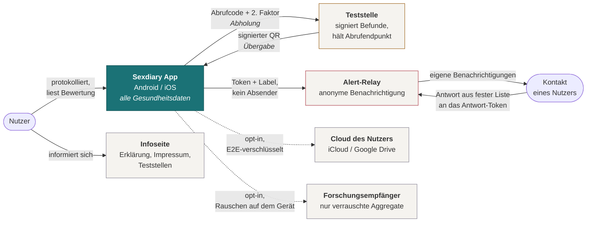
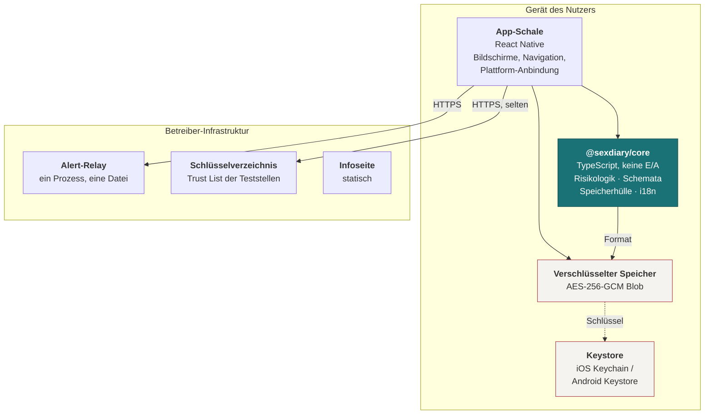
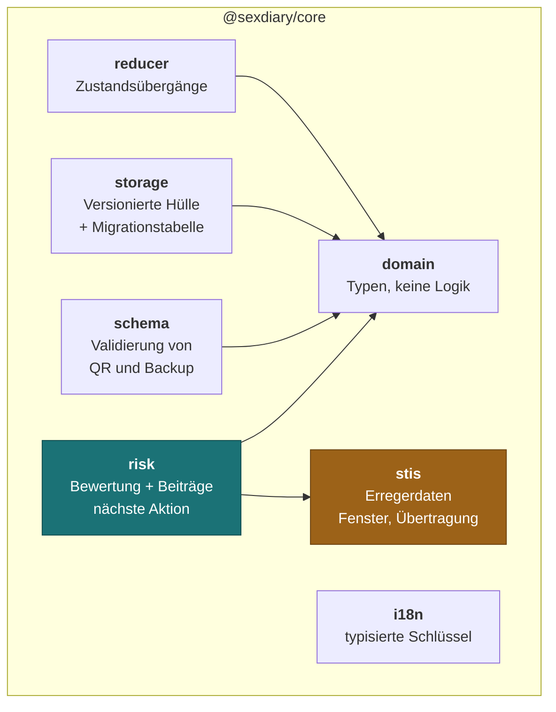
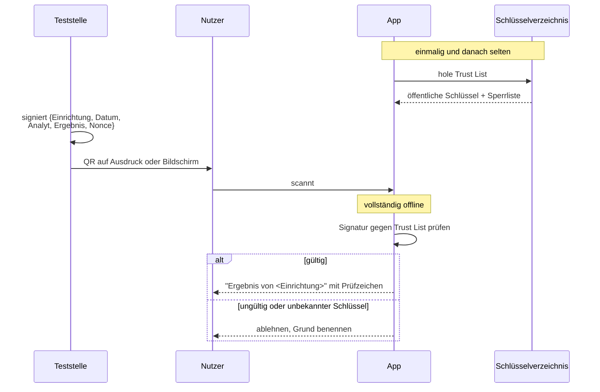
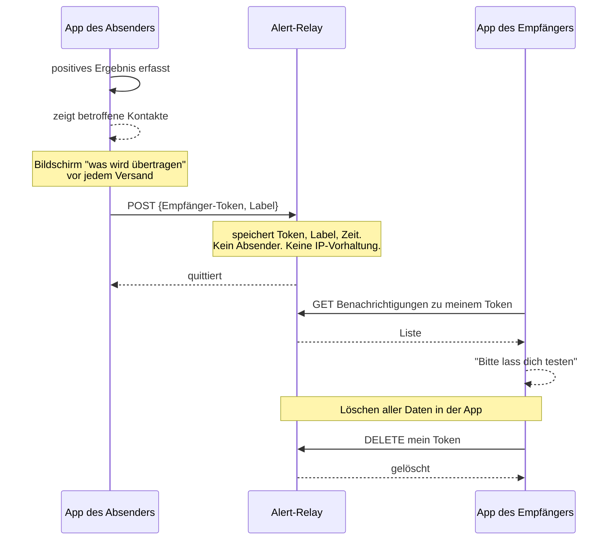
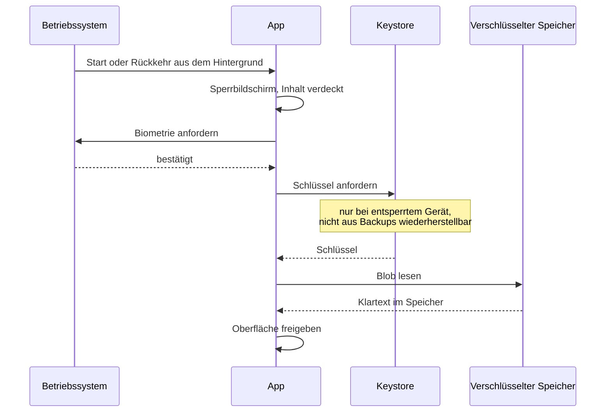
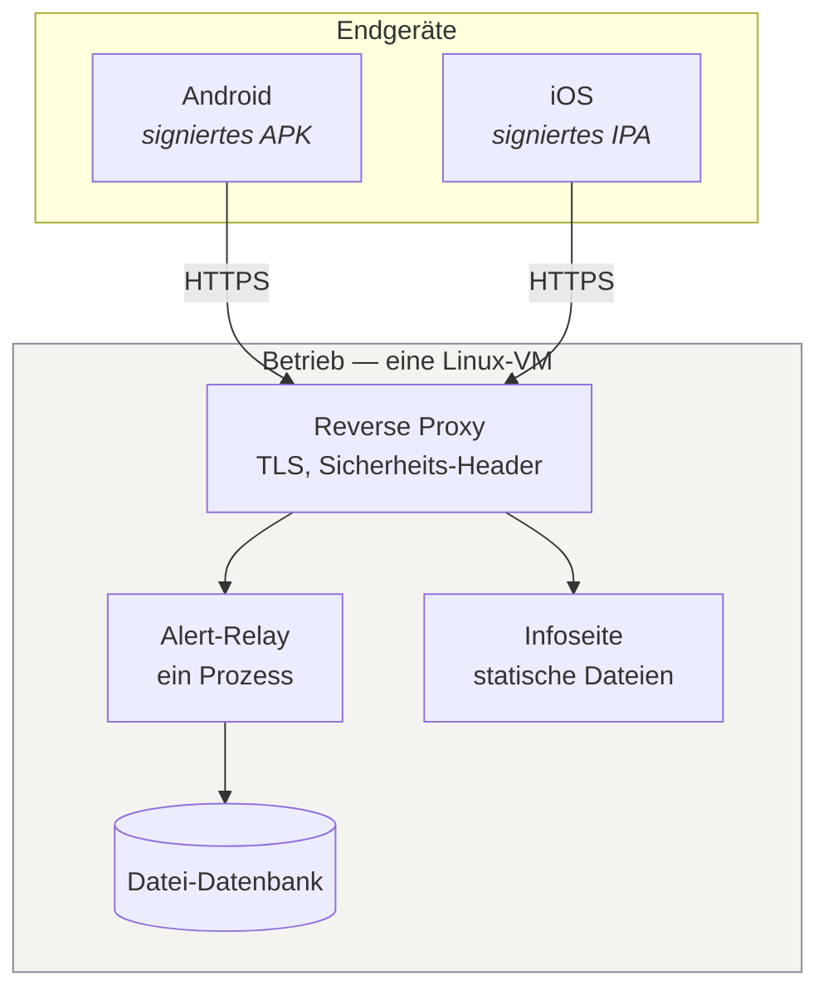

# Sexdiary — Architekturüberblick

Nach [arc42](https://arc42.org). Stand 27.08.2026, Codestand `refactor/welle-0-versionen`.

Was hier steht, ist der Zielzustand nach der Architekturentscheidung vom
27.08.2026 (siehe [ADR-0001](adr/0001-native-only.md)). Wo der Code noch nicht
dort ist, steht das in Abschnitt 11.

---

## 1. Einführung und Ziele

### 1.1 Aufgabenstellung

Sexdiary ist ein persönliches Werkzeug zur sexuellen Gesundheit. Es
protokolliert sexuelle Begegnungen, Tests, Impfungen und Prophylaxen, leitet
daraus ab, wann ein Test aussagekräftig wird, und ermöglicht es, Kontakte nach
einem positiven Befund anonym zu benachrichtigen.

Der eigentliche Zweck ist nicht das Protokoll, sondern die Ableitung: Die
diagnostischen Fenster der einzelnen Erreger sind unterschiedlich lang, und
kaum jemand hat sie im Kopf. Ein Test zum falschen Zeitpunkt ist ein Test ohne
Aussage.

### 1.2 Qualitätsziele

In dieser Reihenfolge. Bei Konflikt gewinnt das höher stehende.

| # | Ziel | Konkret |
|---|---|---|
| 1 | **Vertraulichkeit** | Gesundheitsdaten verlassen das Gerät nicht. Wer das Gerät entsperrt in die Hand bekommt, kommt trotzdem nicht ohne Weiteres an die Daten. |
| 2 | **Nachvollziehbarkeit** | Jede Aussage der App lässt sich auf die Eingaben zurückführen, die sie erzeugt haben. Keine unerklärten Zahlen. |
| 3 | **Prüfbarkeit** | Ein kommunales Prüfteam kann die Gesundheitslogik isoliert lesen und den Build aus der Quelle reproduzieren. |
| 4 | **Barrierefreiheit** | Das öffentliche Angebot erfüllt BITV 2.0. |
| 5 | **Wartbarkeit** | Eine fremde Person kann das System aus dieser Dokumentation übernehmen. |

Ziel 1 steht bewusst über allem anderen. Es ist der Grund, warum die App keine
Konten, keine Synchronisation und keine Analytik hat — und der einzige Grund,
warum sie bei besonderen Kategorien personenbezogener Daten überhaupt
genehmigungsfähig ist.

### 1.3 Stakeholder

| Rolle | Erwartung |
|---|---|
| Nutzer | Diskretion, verlässliche Aussagen, keine Bevormundung, kein Beschämen |
| Gesundheitsamt | Ergänzt die eigene Kontaktnachverfolgung, ersetzt sie nicht; kein neues Fachverfahren |
| Kommunale IT | Wenig Angriffsfläche, betreibbar ohne Spezialwissen, keine Cloud-Abhängigkeit |
| Datenschutzbeauftragte | Minimale serverseitige Verarbeitung, dokumentierte Datenflüsse, belegte Löschwege |
| Teststelle | Ergebnisübergabe ohne eigene Kontoverwaltung |

---

## 2. Randbedingungen

### 2.1 Technisch

- **Zielplattformen:** Android und iOS als native App. Der Browser bekommt eine reine Informationsseite ([ADR-0001](adr/0001-native-only.md)).
- **Keine Drittanbieter-SDKs.** Keine Analytik, kein Crash-Reporting mit Upload, keine Werbenetzwerke, keine externen Schriftarten.
- **Keine Over-the-Air-Updates** ([ADR-0006](adr/0006-keine-ota-updates.md)). Was ausgeliefert wird, ist was geprüft wurde.
- **Versionsstände** folgen `hausbasis/baseline.json`, nicht den Vorgaben einzelner Werkzeuge.

### 2.2 Organisatorisch

- Ein Entwickler. Bus-Faktor 1 ist der bestimmende Faktor für die Menge an Dokumentation.
- Lizenz derzeit ungeklärt. Blockiert Code-Audit, Veröffentlichung auf openCode.de, F-Droid und Nachnutzung.

### 2.3 Rechtlich

- **Art. 9 DSGVO** — Gesundheits- und Sexualleben, strengste Kategorie. Bestimmt die gesamte Architektur.
- **MDR** — die Einordnung ist offen. Die Gestaltung zielt darauf, informierend statt bewertend zu wirken ([ADR-0003](adr/0003-local-first.md), Abschnitt 8.6).
- **BITV 2.0** für das öffentliche Angebot.
- **TMG/DDG** — Impressum und Datenschutzerklärung, sobald öffentlich angeboten.

---

## 3. Kontextabgrenzung

### 3.1 Fachlicher Kontext — C4 Stufe 1

### 3.2 Was das Diagramm sagt

Die App ist der einzige Ort, an dem Gesundheitsdaten liegen. Jede Verbindung
über die Gerätegrenze ist einzeln begründet und schmal:

| Richtung | Inhalt | Wer erfährt was | ADR |
|---|---|---|---|
| Teststelle → App, *Übergabe* | signierter Befund im QR | Die Teststelle erfährt nichts. Die Prüfung ist offline. | [0007](adr/0007-signierte-testergebnisse.md) |
| App → Teststelle, *Abholung* | Abrufcode und zweiter Faktor | Die Teststelle erfährt den Abrufzeitpunkt. Der Betreiber ist **nicht** im Pfad. | [0012](adr/0012-befundabruf.md) |
| App → Relay | Empfänger-Token, Label, Zeit, optional ein Antwort-Token | Das Relay erfährt nicht, wer gesendet hat. | [0008](adr/0008-anonyme-benachrichtigung.md) |
| Kontakt → Relay → App | Antwort aus geschlossener Liste an das Antwort-Token | Wie oben. Keine automatischen Bestätigungen. | [0011](adr/0011-rueckmeldung.md) |
| App ↔ Cloud des Nutzers | verschlüsselter Blob, opt-in | Der Anbieter sieht undurchdringliche Bytes. | [0009](adr/0009-backup-modell.md) |
| App → Forschungsempfänger | verrauschte Aggregate, opt-in | Kein Einzelbeitrag rekonstruierbar — das Rauschen entsteht auf dem Gerät. | [0013](adr/0013-forschungsdaten.md) |

Das sind sechs Verbindungen, wo der ursprüngliche Entwurf drei vorsah. Jede der
drei neuen ist begründet, aber **die Zunahme selbst ist das Risiko**: Jede
Außenschnittstelle vergrößert die Fläche, die eine Datenschutzprüfung durchgeht,
und erzeugt Metadaten, die vorher nicht existierten. Die Regel aus
[`interfaces/README.md`](interfaces/README.md) gilt unverändert — ein Vorschlag
für eine siebte muss zuerst begründen, warum er nicht auf dem Gerät stattfinden
kann.

Die Infoseite hat **keine** Verbindung zur App und kennt keinen Nutzer. Sie ist
bewusst ein getrenntes System, damit ihre Reichweitenmessung, ihr Betrieb und
ihre Barrierefreiheitsprüfung nichts mit Gesundheitsdaten zu tun haben.

---

## 4. Lösungsstrategie

| Qualitätsziel | Lösungsansatz |
|---|---|
| Vertraulichkeit | Keine serverseitige Speicherung von Gesundheitsdaten. Verschlüsselung at rest mit einem Schlüssel im Hardware-Keystore. Geräte-Lock, Screenshot-Schutz, Tarnmodus gegen den Schulterblick. |
| Nachvollziehbarkeit | Die Risikoberechnung gibt nicht nur ein Ergebnis aus, sondern die Beiträge, aus denen es entstanden ist. Jede medizinische Zahl bekommt eine Quellenangabe. |
| Prüfbarkeit | Die gesamte Gesundheitslogik liegt in einem Paket ohne Ein-/Ausgabe und ohne Laufzeit-Abhängigkeiten, mit Unit-Tests. Reproduzierbarer Build aus der Quelle. |
| Barrierefreiheit | Infoseite von Grund auf nach BITV gebaut statt nachträglich saniert. Risiko nie nur über Farbe kodiert. |
| Wartbarkeit | Ein Monorepo, gemeinsamer Versionsstand mit den Schwesterprojekten, diese Dokumentation. |

Die tragende Entscheidung ist die Trennung zwischen **Gesundheitslogik** (rein,
getestet, plattformfrei) und **Plattformschale** (dünn, austauschbar). Sie
existiert nicht aus Eleganz, sondern damit ein Prüfer die eine Hälfte lesen kann,
ohne die andere zu verstehen.

---

## 5. Bausteinsicht

### 5.1 Ebene 1 — Container, C4 Stufe 2

| Baustein | Verantwortung | Bewusst *nicht* zuständig für |
|---|---|---|
| App-Schale | Darstellung, Navigation, Kamera, Biometrie, Benachrichtigungen | Gesundheitslogik, Datenformate |
| `@sexdiary/core` | Risikoberechnung, Domänenmodell, Import-/Export-Schemata, Speicherformat mit Migrationen, Übersetzungen | Alles mit Ein-/Ausgabe. Das Paket kennt weder Dateisystem noch Netzwerk noch DOM. |
| Verschlüsselter Speicher | Bytes auf Platte | Wissen über die Struktur der Daten |
| Keystore | Verwahrung des Schlüssels, hardwaregestützt wo verfügbar | Alles andere |
| Alert-Relay | Entgegennahme, Auslieferung und Löschung anonymer Benachrichtigungen | Absender kennen, Inhalte speichern, Nutzer verwalten |
| Schlüsselverzeichnis | Öffentliche Schlüssel der Teststellen, Sperrliste | Nutzerkontakt |

### 5.2 Ebene 2 — Innenleben von `@sexdiary/core`, C4 Stufe 3

`risk` und `stis` sind die eigentliche Prüffläche. Sie sind der Grund, warum
dieses Paket keine Laufzeit-Abhängigkeiten hat: Ein Fachreferat soll die
Übertragungswahrscheinlichkeiten und die Fensterlängen lesen können, ohne einen
Abhängigkeitsbaum zu durchdringen.

`risk` liefert nicht nur eine Stufe, sondern die **Beiträge**, die zu ihr geführt
haben — welche Begegnung, welche Praktik, ob Schutz protokolliert war. Das ist
gleichzeitig das stärkste Vertrauensmerkmal und das Argument, das die App vom
Bewertungswerkzeug zum Aufklärungswerkzeug verschiebt.

---

## 6. Laufzeitsicht

### 6.1 Import eines signierten Testergebnisses

Der Ablauf, der „nicht leicht zu fälschen“ einlöst. Vollständige Spezifikation
in [`interfaces/signed-results.md`](interfaces/signed-results.md).

Die Prüfung findet **offline** statt. Das ist keine Bequemlichkeit, sondern
Voraussetzung: Ein Netzwerkaufruf beim Scannen würde dem Betreiber verraten,
wann wer ein Ergebnis importiert.

### 6.2 Partner-Benachrichtigung nach positivem Befund

Der `DELETE`-Weg ist ab dem ersten Tag Teil der Schnittstelle, nicht später
nachgerüstet — Art. 17 verlangt, dass „alles löschen“ in der App auch die
serverseitigen Benachrichtigungen an das eigene Token erfasst.

### 6.3 Start der App bei gesetztem Lock

---

## 7. Verteilungssicht

Bewusst langweilig. Kein Serverless, keine verwaltete Datenbank, kein
Anbieter-SDK — weil das Lieferobjekt an eine Kommune nicht die laufende Instanz
ist, sondern das **Deployment-Artefakt**: Container-Definition, Compose-Datei,
Betriebshandbuch, Sicherungs- und Wiederherstellungsprozedur. Je weniger
beweglich, desto billiger die Sicherheitsprüfung.

Verteilung der App während der Erprobung: siehe
[ADR-0010](adr/0010-verteilung-erprobung.md).

---

## 8. Querschnittliche Konzepte

### 8.1 Datenhaltung und Migration

Der Speicher ist eine versionierte Hülle mit Schemaversion, Zeitstempel und
Nutzlast. Beim Lesen läuft eine Migrationskette von der gespeicherten bis zur
aktuellen Version. Unlesbare Daten werden **in Quarantäne verschoben, nie
gelöscht** — bei Daten, die nirgends sonst existieren, ist stilles Verwerfen die
schlimmste mögliche Reaktion.

Daten aus einer *neueren* App-Version werden abgelehnt statt geraten.

### 8.2 Verschlüsselung

Ein 256-Bit-Schlüssel, erzeugt beim ersten Start, verwahrt im Keystore mit der
Einstellung „nur bei entsperrtem Gerät, nur dieses Gerät“ — er wandert damit
nicht in Systembackups. Nutzdaten AES-256-GCM. Systembackup ist ausgeschaltet;
Sicherung läuft ausschließlich über den bewussten Weg aus
[ADR-0009](adr/0009-backup-modell.md).

### 8.3 Diskretion

Das realistische Bedrohungsmodell ist die Person daneben, nicht der Angreifer im
Netz. Daraus folgen Maßnahmen, die keine Kryptografie sind: neutraler App-Name
und neutrales Icon auf Wunsch, ein Tarnbildschirm auf einen Griff,
Screenshot-Sperre, verdeckte Vorschau in der App-Übersicht. Siehe
[`threat-model.md`](threat-model.md).

### 8.4 Internationalisierung

Typisierte Schlüssel; eine fehlende Übersetzung bricht den Build. Zählwörter
werden als Substantiv eingesetzt statt als Suffix angehängt, weil deutsche
Plurale keine angehängten Endungen vertragen.

Beim Sprung auf die dritte Sprache steht der Wechsel auf ICU MessageFormat an —
professionelle Übersetzer und ihre Werkzeuge erwarten es.

### 8.5 Barrierefreiheit

Risiko wird nie allein über Farbe kodiert; Textlabel und Form tragen dieselbe
Aussage. Bedienelemente mit reiner Symbolbeschriftung tragen ein Label.
Reduzierte Bewegung wird respektiert. Kontraste sind in beiden Erscheinungsbildern
zu belegen, nicht zu schätzen.

### 8.6 Sprachliche Haltung

Die App informiert, sie diagnostiziert nicht. Konkret: keine Prozentzahl als
Hauptaussage, sondern eine Handlungsempfehlung mit Begründung; keine Wertung von
Verhalten; keine Serien oder Streaks, weil sie Lücken beschämen und für sexuelle
Gesundheit das falsche Werkzeug sind.

Das ist gleichzeitig Produktgestaltung und regulatorische Position.

---

## 9. Architekturentscheidungen

Vollständig in [`adr/`](adr/). Die tragenden:

| ADR | Entscheidung | Status |
|---|---|---|
| [0001](adr/0001-native-only.md) | Native App als Produkt, Web nur informierend | angenommen |
| [0002](adr/0002-geteilter-kern.md) | Geteilte Gesundheitslogik in einem E/A-freien Paket | angenommen |
| [0003](adr/0003-local-first.md) | Keine Gesundheitsdaten auf dem Server | angenommen |
| [0004](adr/0004-react-native.md) | React Native statt zweier nativer Codebasen | angenommen |
| [0005](adr/0005-verschluesselung-at-rest.md) | Keystore-gehaltener Schlüssel, AES-256-GCM | angenommen |
| [0006](adr/0006-keine-ota-updates.md) | Keine Over-the-Air-Updates | angenommen |
| [0007](adr/0007-signierte-testergebnisse.md) | Signierte Ergebnis-QRs nach dem Muster des EU-COVID-Zertifikats | vorgeschlagen |
| [0008](adr/0008-anonyme-benachrichtigung.md) | Tokenbasierte Benachrichtigung ohne Konten | angenommen |
| [0009](adr/0009-backup-modell.md) | Sicherung in die Cloud des Nutzers, Ende-zu-Ende verschlüsselt | vorgeschlagen |
| [0010](adr/0010-verteilung-erprobung.md) | Verteilung während der Erprobung | vorgeschlagen |
| [0011](adr/0011-rueckmeldung.md) | Rückmeldung des Benachrichtigten, ohne Absenderidentität | vorgeschlagen |
| [0012](adr/0012-befundabruf.md) | Befundabruf über einen Code bei der Teststelle | vorgeschlagen |
| [0013](adr/0013-forschungsdaten.md) | Forschungsbeitrag nur als verrauschtes Aggregat | vorgeschlagen |
| [0014](adr/0014-hauptbildschirm.md) | Hauptbildschirm: Antwort zuerst, Zeitachse als Variante | angenommen |

---

## 10. Qualitätsanforderungen

### 10.1 Szenarien

| # | Szenario | Erwartetes Verhalten |
|---|---|---|
| Q1 | Jemand bekommt das entsperrte Telefon in die Hand | App ist gesperrt oder zeigt den Tarnbildschirm; Daten bleiben unlesbar |
| Q2 | Ein Angreifer hat das ausgeschaltete Gerät und ein Systembackup | Backup enthält weder Schlüssel noch Nutzdaten |
| Q3 | Jemand fälscht einen Ergebnis-QR | App lehnt ab und benennt den Grund |
| Q4 | Das Alert-Relay wird vollständig kompromittiert | Angreifer erlangt Tokens, Labels, Zeitstempel — keine Identitäten, keine Historien |
| Q5 | Ein Nutzer löscht alle Daten | Lokale Daten weg, serverseitige Benachrichtigungen zum eigenen Token ebenfalls |
| Q6 | Eine App-Version ändert das Datenschema | Bestandsdaten migrieren; unlesbares wandert in Quarantäne, wird nie verworfen |
| Q7 | Ein Prüfteam will die Gesundheitslogik lesen | Ein Paket, keine Laufzeit-Abhängigkeiten, Unit-Tests, Quellenangaben an den Zahlen |
| Q8 | Screenreader-Nutzung der Risikoanzeige | Stufe ist als Text verfügbar, nicht nur als Farbe |

### 10.2 Nachweis

Q1–Q3 und Q5–Q6 sind auf Geräteebene zu belegen. Q4 ist eine Eigenschaft des
Datenmodells und in [`data-flow.md`](data-flow.md) begründet. Q7 gilt heute
teilweise: Das Paket ist so gebaut, die Quellenangaben fehlen noch.

---

## 11. Risiken und technische Schulden

Ehrliche Liste. Ein Dokument, das den Ist-Zustand beschönigt, ist im Audit
schlimmer als keins.

| # | Punkt | Wirkung | Wo |
|---|---|---|---|
| R1 | **Die App ist nie auf einem Gerät gelaufen.** Verifiziert sind Typecheck, Tooling-Check, Bundle-Export. | Alle Geräteaussagen dieses Dokuments sind unbelegt | Welle 3 |
| R2 | **Der App-Lock ist simuliert.** Eine PIN sperrt die Oberfläche; sie leitet keinen Schlüssel ab. Im UI als solches beschriftet. | Q1 nur teilweise erfüllt | Welle 3 |
| R3 | **Medizinische Zahlen ohne Quellenangabe.** Die Werte halten der Prüfung stand, aber ohne Beleg sieht das Gute aus wie das Erfundene. | Erster Angriffspunkt eines Fachreferats | Welle 2 |
| R4 | **Symptomlisten sind schablonenhaft** — fünf Erreger, jeweils exakt drei Einträge. Der Inhalt wurde einer Form angepasst statt der Krankheit. | Glaubwürdigkeit | Welle 2 |
| R5 | **Keine CI, kein Linter.** Die Zusicherung reproduzierbarer Builds ist unbelegt. | Prüfbarkeit, Ziel 3 | Welle 2 |
| R6 | **Der Kern ist über einen Bundler-Alias eingebunden**, nicht als Paket. Nichts außerhalb des Monorepos kann ihn nutzen. | Relay und App hätten zwei Wahrheiten über das Payload-Format | Welle 2 |
| R7 | **Zwei Einstellungsschalter ohne Wirkung** (Benachrichtigungen, Sperre). | Die App verspricht Schutz, den sie nicht leistet | Welle 2/3 |
| R8 | **Risiko nur über Farbe kodiert.** | BITV-Verstoß, Ziel 4 | Welle 2 |
| R9 | **Lizenz ungeklärt.** | Blockiert Audit, openCode, F-Droid, Nachnutzung | sofort |
| R10 | **MDR-Einordnung offen.** | Kommt im Amtsgespräch in den ersten zwanzig Minuten | vor dem Pitch |
| R11 | **Der Web-Tracker existiert noch** und dupliziert das Produkt. | Zwei Produkte mit einem Namen, doppelte Pflege | Welle 4 |
| R12 | **Bus-Faktor 1.** | Diese Dokumentation ist die Gegenmaßnahme, nicht die Lösung | dauerhaft |
| R13 | **Die Außenfläche ist von drei auf sechs Verbindungen gewachsen** (Rückmeldung, Befundabruf, Forschungsbeitrag). Jede einzeln begründet, die Zunahme bleibt ein Risiko | Größere Prüffläche, mehr Metadaten | laufend |
| R14 | **Der Befundabruf hängt an der Teststelle**, nicht am Betreiber. Ohne Referenzimplementierung für die Teststellenseite bleibt die Funktion theoretisch | Signierte Befunde ohne Gegenstelle | Welle 5 |
| R15 | **Der Forschungsbeitrag verbraucht Privatsphärebudget über die Zeit.** Ohne Budgetverwaltung ist die Anonymitätszusicherung nach genügend Übertragungen wertlos | Zusicherung nicht haltbar | vor dem Bau |
| R16 | **Die Warnfarbe `#B7791F` liegt bei 3,64:1 auf Weiß** und fällt als Text durch. Vorbestehend, unabhängig von der Token-Entscheidung | BITV-Verstoß, Ziel 4 | Welle 2 |
| R17 | **Der zweite Kodierungskanal neben der Risikofarbe fehlt weiterhin.** Die verworfene Variante B hätte ihn über die Position auf einer Zeitachse mitgeliefert; unter Richtung A muss er eigens gebaut werden | BITV-Verstoß, Ziel 4 | Welle 2 |

---

## 12. Glossar

| Begriff | Bedeutung |
|---|---|
| **Diagnostisches Fenster** | Zeitraum nach einer Exposition, in dem ein Test noch negativ ausfällt, obwohl eine Infektion vorliegt. Der Kernbegriff der App. |
| **Token** | Zufälliger, nicht zurückrechenbarer Bezeichner für eine Benachrichtigungsbeziehung. Ersetzt Konten. |
| **Trust List** | Verzeichnis der öffentlichen Schlüssel, deren Signatur die App als Ergebnis einer Teststelle akzeptiert. |
| **Beiträge** | Die einzelnen Begegnungen und Praktiken, aus denen eine Risikoaussage entstanden ist. Werden dem Nutzer gezeigt. |
| **PrEP / Doxy-PEP** | Medikamentöse Prophylaxen vor bzw. nach Exposition. Beeinflussen die Bewertung. |
| **Tarnmodus** | Neutraler Name und neutrales Erscheinungsbild, plus Tarnbildschirm auf einen Griff. Gegen den Schulterblick, nicht gegen Forensik. |
| **arc42 / C4 / ADR / MADR** | Die Formate dieser Dokumentation, siehe [README](README.md). |
| **BITV 2.0** | Barrierefreie-Informationstechnik-Verordnung. Verbindlich für öffentliche Stellen. |
| **Hausbasis** | Repository-übergreifende Vorgabe der Abhängigkeitsversionen. |
