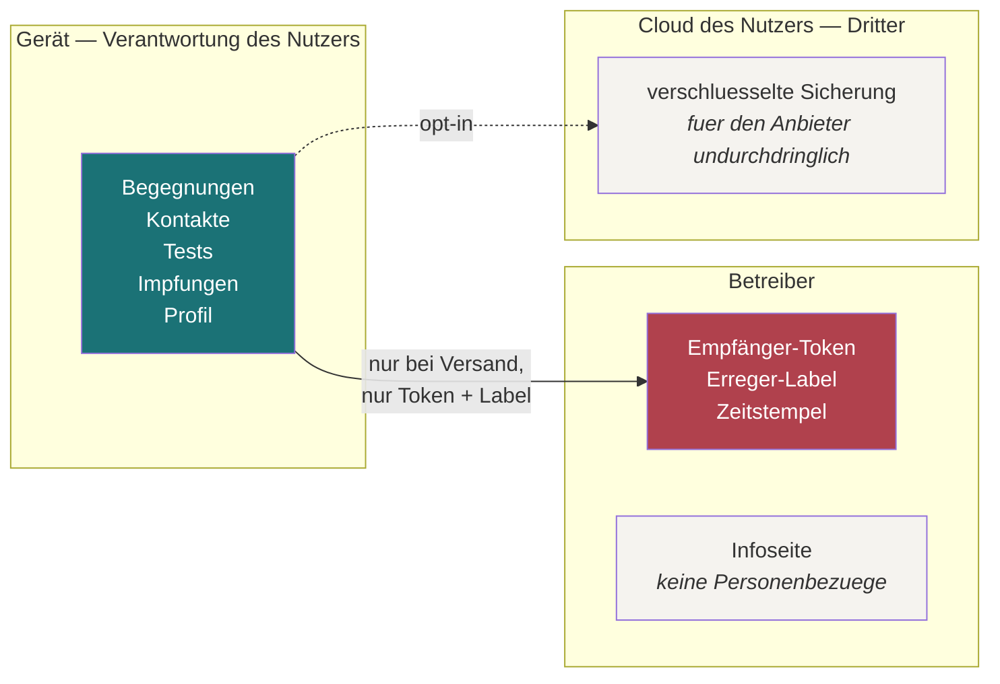

# Datenflüsse und Verarbeitungsübersicht

Vorarbeit für das Verzeichnis von Verarbeitungstätigkeiten nach Art. 30 DSGVO
und für die Datenschutz-Folgenabschätzung nach Art. 35.

**Kein Rechtsrat.** Das Dokument beschreibt, was technisch geschieht, damit ein
Datenschutzbeauftragter darauf aufsetzen kann.

## Ausgangslage

Alle fachlichen Daten fallen unter **Art. 9 Abs. 1 DSGVO** — Gesundheitsdaten
und Daten zum Sexualleben. Die Architektur zielt darauf, die Verarbeitung durch
den Betreiber so weit zu reduzieren, dass sie in einer Tabelle Platz findet.

## Wo Daten liegen

Der rote Kasten ist die **gesamte** Verarbeitung durch den Betreiber.

## Verarbeitungstätigkeiten

### V1 — Führen des persönlichen Protokolls

| | |
|---|---|
| Zweck | Der Nutzer protokolliert seine eigenen Daten und lässt sich Testzeitpunkte ableiten |
| Kategorien | Begegnungen, Praktiken, Kontaktbezeichnungen, Testergebnisse, Impfungen, Prophylaxen, Alter, anatomische Angabe |
| Betroffene | Der Nutzer; mittelbar seine Kontakte, soweit er sie benennt |
| Empfänger | keine |
| Uebermittlung an Drittländer | keine |
| Speicherdauer | bis der Nutzer löscht |
| Technische Maßnahmen | AES-256-GCM, Schlüssel im Keystore, App-Lock, Systembackup aus |
| **Verarbeitet der Betreiber?** | **Nein.** Die Verarbeitung findet ausschließlich auf dem Gerät statt |

Die letzte Zeile ist die zentrale Aussage. Ob damit überhaupt eine
Verarbeitung im Sinne der Verordnung durch den Betreiber vorliegt, ist die
Frage, die fachlich zu klären ist — die technische Antwort lautet: Der
Betreiber hat zu keinem Zeitpunkt Zugriff.

### V2 — Partner-Benachrichtigung

| | |
|---|---|
| Zweck | Einen früheren Kontakt anonym auf einen sinnvollen Test hinweisen |
| Kategorien | Empfänger-Token (Pseudonym), Erreger-Label, Zeitstempel, optional ein Antwort-Token |
| Betroffene | Der Empfänger |
| **Nicht** verarbeitet | Absenderidentität, Klarnamen, Kontaktdaten, Nachrichtentext, IP über den Transport hinaus |
| Rechtsgrundlage | Einwilligung; der Versand erfolgt auf ausdrückliche Handlung nach einem Bildschirm, der den Inhalt zeigt |
| Speicherdauer | kurz, mit automatischem Verfall — **Dauer noch festzulegen** |
| Löschung | `DELETE` auf das eigene Token, ausgelöst durch „Alles löschen“ in der App (Art. 17) |
| Technische Maßnahmen | Transportverschlüsselung, keine Zugriffsprotokolle mit Personenbezug, ein Dienst ohne ausgehende Verbindungen |

**Rückmeldung** ([ADR-0011](adr/0011-rueckmeldung.md)): Die Antwort des
Empfängers ist dieselbe Verarbeitung in die Gegenrichtung — eine Angabe aus
einer geschlossenen Liste, gerichtet an ein Antwort-Token. Keine automatischen
Zustell- oder Lesebestätigungen; jedes Signal ist eine aktive Handlung des
Empfängers und damit eine eigene Einwilligung.

### V2b — Befundabruf bei der Teststelle

| | |
|---|---|
| Status | vorgeschlagen, [ADR-0012](adr/0012-befundabruf.md) |
| Zweck | Einen bereits erhobenen Befund strukturiert und signiert in die App holen |
| Kategorien | Abrufcode, zweiter Faktor, danach der Befund |
| **Verantwortlich** | Die **Teststelle**, nicht der Betreiber |
| Besonderheit | Der Betreiber ist an diesem Weg **nicht beteiligt** und erfährt nichts |
| Was die Teststelle erfährt | den Abrufzeitpunkt — den Befund kennt sie ohnehin |

Diese Zeile ist im Gespräch wichtig: Der Befundabruf *sieht aus* wie eine neue
serverseitige Verarbeitung, ist aber keine des Betreibers. Die Rechtsbeziehung
besteht zwischen Nutzer und Teststelle, und sie existiert dort bereits.

### V3 — Betrieb der Infoseite

| | |
|---|---|
| Zweck | Erklärung, Impressum, Datenschutzerklärung, Teststellenverzeichnis |
| Kategorien | keine über die technisch notwendigen Server-Logs hinaus |
| Besonderheit | **Keine Requests an Dritte.** Keine externen Schriften, keine Einbettungen, keine Analytik, kein Consent-Banner nötig |
| Speicherdauer | Server-Logs kurz, IP gekürzt oder gar nicht |

### V4 — Sicherung in die Cloud des Nutzers

| | |
|---|---|
| Status | vorgeschlagen, ADR-0009 |
| Zweck | Wiederherstellung nach Geräteverlust |
| Kategorien | wie V1, jedoch ausschließlich als Chiffrat |
| Empfänger | Der Cloud-Anbieter des Nutzers — **nicht der Betreiber** |
| Rechtsbeziehung | zwischen Nutzer und seinem Cloud-Anbieter. Der Betreiber ist nicht beteiligt |
| Technische Maßnahmen | Verschlüsselung mit nutzerabgeleitetem Schlüssel vor dem Upload |

### V5 — Forschungsbeitrag

| | |
|---|---|
| Status | vorgeschlagen, [ADR-0013](adr/0013-forschungsdaten.md) — **nicht gebaut** |
| Zweck | Epidemiologische Kennzahlen für den öffentlichen Gesundheitsdienst |
| Kategorien | **keine personenbezogenen.** Auf dem Gerät vergröberte, aggregierte und verrauschte Kennzahlen |
| Rechtsgrundlage | Bei korrekter Umsetzung nicht erforderlich, weil die Daten anonym sind — die Einwilligung wird trotzdem eingeholt |
| Speicherdauer | beim Empfänger, nach dessen Regeln |
| Technische Maßnahmen | Vergröberung vor Aggregation, Rauschen **auf dem Gerät**, Schwellwert vor Veröffentlichung, getrennter Kanal, Budgetverwaltung |

**Der Punkt, an dem diese Zeile kippt:** Würden statt Aggregaten
pseudonymisierte Einzeldatensätze übertragen, wäre das eine Verarbeitung
besonderer Kategorien durch den Betreiber — mit Folgenabschätzung,
Löschkonzept, Betroffenenrechten und dem Ende der Aussage aus V1.
Pseudonymisiert ist nach Art. 4 Nr. 5 nicht anonym. Genau deshalb verwirft
ADR-0013 diesen Weg.

## Betroffenenrechte

| Recht | Umsetzung |
|---|---|
| Auskunft (Art. 15) | Der Nutzer hat die Daten selbst; die App zeigt zusätzlich alle Rohdatensätze in lesbarer Form |
| Berichtigung (Art. 16) | Jeder Datensatz ist in der App bearbeitbar |
| Löschung (Art. 17) | „Alles löschen“ in der App, plus `DELETE` auf das eigene Token beim Relay |
| Datenübertragbarkeit (Art. 20) | Export als Datei in einem dokumentierten Format |
| Widerspruch (Art. 21) | Es findet keine Verarbeitung statt, der widersprochen werden könnte, außer V2 — und die erfolgt nur auf ausdrückliche Handlung |

Die Auskunft ist hier ungewöhnlich einfach, weil der Betroffene die Daten
ohnehin besitzt. Das ist ein Nebeneffekt der Architektur, den man im Gespräch
benennen sollte.

## Offene Punkte für die fachliche Prüfung

1. Ob V1 überhaupt eine Verarbeitung durch den Betreiber darstellt.
2. Aufbewahrungsdauer in V2.
3. Ob die Nennung eines Kontakts durch den Nutzer eine Verarbeitung
   personenbezogener Daten Dritter darstellt und was daraus folgt.
4. Notwendigkeit und Umfang der Folgenabschätzung — vermutlich ab dem Moment
   verpflichtend, in dem das Relay öffentlich betrieben wird.
5. Rolle des Cloud-Anbieters in V4.
6. Ob V5 bei der beschriebenen Umsetzung tatsächlich anonym im Sinne des
   Erwägungsgrundes 26 ist. Das muss belegt werden, nicht behauptet — und es ist
   der Punkt, an dem eine Prüfung ansetzen wird.
