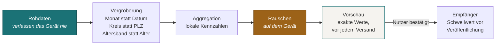

# Schnittstelle: Forschungsbeitrag

**Status:** Entwurf · **nicht zu bauen** · 27.08.2026 · setzt [ADR-0013](../adr/0013-forschungsdaten.md) um

Richtung: App → Forschungsempfänger. Ausschließlich opt-in.

> **Diese Schnittstelle wird nicht gebaut, bevor ein Forschungspartner mit
> Ethikvotum existiert.** Ein Export, der ohne Forschungsfrage entworfen wird,
> aggregiert über die falschen Dimensionen und vergröbert die, auf die es
> angekommen wäre. Die Spezifikation entsteht trotzdem jetzt, weil sie das
> Datenmodell einschränkt — Vergröberung muss möglich sein, und das entscheidet
> sich beim Entwurf.

## Die Festlegung, die alles andere trägt

**Es werden niemals Einzeldatensätze übertragen.** Auch nicht pseudonymisiert.

Pseudonymisierte Daten bleiben nach Art. 4 Nr. 5 DSGVO personenbezogen — Art. 9
gilt vollständig weiter. Und Sexualgesundheitsdaten sind außergewöhnlich
re-identifizierbar: Altersband, Region, Anatomie und ein Befund genügen in einer
mittleren Stadt häufig zur Eindeutigkeit. Ein solcher Datensatz wäre pseudonym
auf dem Papier und identifizierend in der Praxis.

Was übertragen wird, sind **auf dem Gerät berechnete, vergröberte, verrauschte
Aggregate**.

## Verarbeitungskette

Der entscheidende Schritt ist das **Rauschen auf dem Gerät**, nicht beim
Empfänger. Damit hängt die Zusicherung nicht am Wohlverhalten des Betreibers,
sondern ist eine Eigenschaft der übertragenen Daten. Ein kompromittierter
Empfänger gewinnt nichts.

## Bindende Eigenschaften

| # | Eigenschaft | Warum |
|---|---|---|
| F1 | Nur Aggregate, nie Einzelsätze | Siehe oben |
| F2 | Vergröberung **vor** der Aggregation | Nachträglich vergröbern hilft nicht, wenn die feine Zelle schon existiert hat |
| F3 | Rauschen auf dem Gerät | Verlagert die Zusicherung vom Versprechen zur Eigenschaft |
| F4 | Schwellwert beim Empfänger vor Veröffentlichung einer Zelle | Schützt gegen kleine Zellen, die das Rauschen nicht trägt |
| F5 | Getrennter Kanal, nicht mit dem Benachrichtigungs-Token verknüpfbar, nicht in derselben Sitzung | Sonst wird der Beitrag über Metadaten an einen Alert-Versand gebunden |
| F6 | Vorschau der **tatsächlich zu sendenden Werte** vor jedem Versand | Einwilligung, die diesen Namen verdient |
| F7 | Jederzeit widerrufbar, granular | Art. 7 Abs. 3 |
| F8 | Je Installation vollständig abschaltbar auslieferbar | Eine Einführung muss die Funktion weglassen können |
| F9 | Budgetverwaltung über die Lebensdauer der Installation | Wiederholte Beiträge verbrauchen Privatsphärebudget. Ohne Verwaltung verfällt die Zusicherung mit der Zeit — **der am leichtesten übersehene Punkt** |

## Was das kostet

Verrauschte Aggregate beantworten grobe Fragen, keine feinen. Das ist zu
benennen, nicht zu beschönigen: Wer Verlaufsanalysen auf Individualebene
braucht, bekommt sie hier nicht und soll sie hier nicht bekommen.

Was realistisch geht: Häufigkeiten nach Erreger und Monat, Testkadenz in groben
Bändern, Schutzverwendung als Anteil, regionale Verteilung auf Kreisebene.

## Offen

1. Welche Kennzahlen überhaupt — hängt vollständig an der Forschungsfrage.
2. Rauschparameter und Budgetverwaltung.
3. Schwellwert beim Empfänger.
4. Ob der Beitrag in dieses Produkt gehört oder in eine getrennte, ausdrücklich
   als Studienteilnahme gestaltete Funktion. Letzteres wäre ehrlicher — eine
   Studienteilnahme ist etwas anderes als eine Produktfunktion, und sie sollte
   sich auch so anfühlen.
