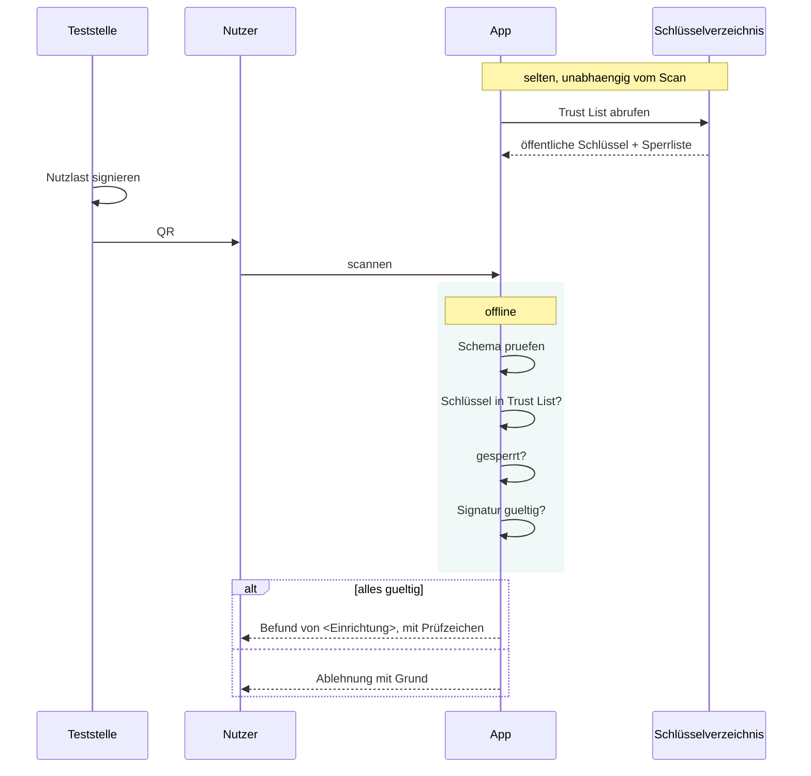
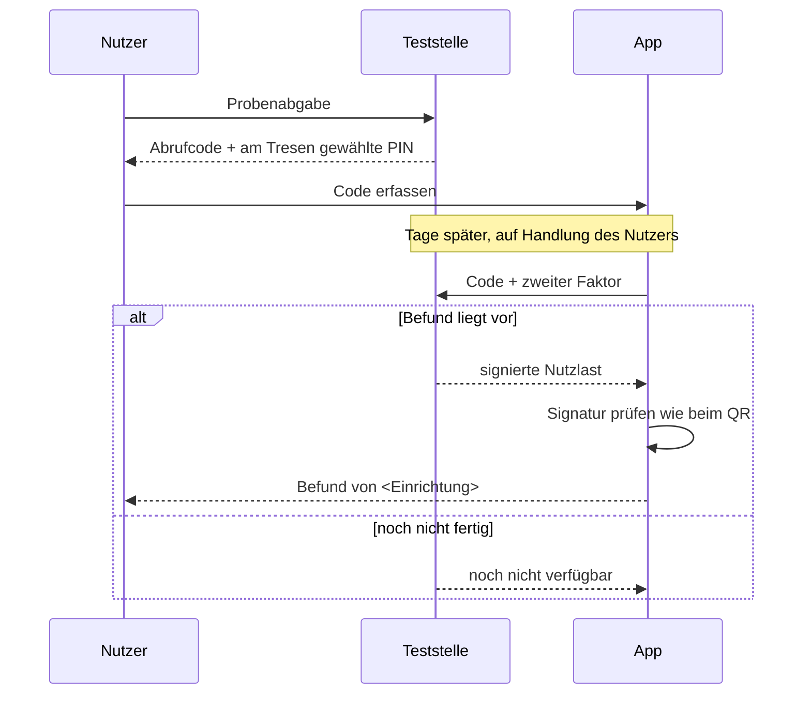

# Schnittstelle: signierter Ergebnis-QR

**Status:** Entwurf · 27.08.2026 · setzt [ADR-0007](../adr/0007-signierte-testergebnisse.md) um

Richtung: Teststelle ↔ App. **Zwei Wege, ein Nutzlastformat.** In keinem der
beiden Fälle gibt es einen Netzweg zwischen Teststelle und *Betreiber*.

| Weg | Wann | Träger | ADR |
|---|---|---|---|
| **Übergabe** | Der Befund existiert bereits | QR auf Ausdruck oder Bildschirm | [0007](../adr/0007-signierte-testergebnisse.md) |
| **Abholung** | Der Befund kommt erst in Tagen | Abrufcode, später online geholt | [0012](../adr/0012-befundabruf.md) |

Die Abholung ist der **häufigere** Fall und wurde im ersten Entwurf übersehen:
Zum Zeitpunkt der Probenabgabe liegt kein Ergebnis vor. Ein QR am Tresen kann
keinen Befund enthalten. Ohne den Abrufweg bleibt die ganze Funktion
theoretisch.

## Anforderungen

| # | Anforderung | Warum |
|---|---|---|
| A1 | Ein Dritter kann kein Ergebnis erzeugen, das die App als Befund einer Teststelle annimmt | Der eigentliche Zweck |
| A2 | Die Prüfung läuft **vollständig offline** | Ein Netzwerkaufruf beim Scannen verriete dem Betreiber, wann wer importiert — Widerspruch zu ADR-0003 |
| A3 | Die Teststelle erfährt nichts über den Nutzer oder den Zeitpunkt des Imports | Kein Rückkanal |
| A4 | Ein kompromittierter Schlüssel ist sperrbar | Betrieb über Jahre |
| A5 | Die Nutzlast passt in einen QR, der auf einem Kassenbon lesbar bleibt | Praxistauglichkeit |
| A6 | Die App unterscheidet **sichtbar** zwischen signiert und selbst eingetragen | Der größte Teil des Vertrauensgewinns |

A6 ist die wichtigste Zeile der Tabelle. Sie wirkt bereits, solange noch keine
einzige Teststelle mitmacht — sie macht aus jeder Eingabe eine ehrlich
etikettierte Aussage.

## Vorbild

Das EU-COVID-Zertifikat hat dieses Problem im deutschen Kontext bereits
gelöst: signierte Nutzlast im QR, nationale Trust List, offline prüfbar. Die
Form ist bekannt, erprobt und im Gespräch mit einer Verwaltung ohne langes
Vorwort erklärbar. Sie wird hier übernommen, nicht neu erfunden.

## Nutzlast

Inhaltlich enthalten:

| Feld | Bedeutung |
|---|---|
| Kennung der Einrichtung | wird dem Nutzer angezeigt |
| Ausstellungsdatum | |
| Probendatum | für die Fensterberechnung ausschlaggebend |
| Untersuchte Erreger mit Befund | je Erreger ein Ergebnis |
| Nonce | verhindert, dass zwei identische Befunde denselben QR ergeben |
| Signatur über alle vorgenannten Felder | |

Ausdrücklich **nicht** enthalten: Name, Geburtsdatum oder sonstige
Identifikatoren des Nutzers. Der QR ist ein Befund, kein Ausweis — er belegt,
dass *diese Probe* *dieses Ergebnis* hatte, nicht wer sie abgegeben hat.

Das ist ein bewusster Unterschied zum COVID-Zertifikat und die datenschutz-
freundlichere Variante. Der Preis: Ein QR ist weitergebbar. Für den Zweck —
die eigene Historie führen — ist das hinnehmbar.

## Ablauf

## Verhalten bei Fehlern

Die App sagt, **warum** sie ablehnt — unbekannter Aussteller, gesperrter
Schlüssel, ungültige Signatur, unlesbares Format. Eine pauschale Ablehnung
erzeugt beim Nutzer den Verdacht, die App sei kaputt, und bei der Teststelle
keinen Hinweis auf die Ursache.

Ein abgelehnter QR darf als **selbst eingetragener** Datensatz übernommen
werden können, sofern der Nutzer das ausdrücklich wählt. Er ist dann als
solcher etikettiert. Andernfalls wäre die App bei einer nicht teilnehmenden
Teststelle schlechter benutzbar als ohne die ganze Funktion.

## Trust List

- Wird mit der App ausgeliefert, damit die erste Prüfung ohne Netz funktioniert.
- Aktualisierung selten und unabhängig vom Scanvorgang, damit der Abruf nichts
  über einen Import verrät.
- Enthält je Aussteller: Kennung, öffentlicher Schlüssel, Gültigkeitszeitraum,
  Anzeigename.
- Sperrliste getrennt, damit sie häufiger aktualisiert werden kann.

## Der Abholweg im Einzelnen

Bindende Eigenschaften:

1. **Der Abruf geht an die Teststelle, nicht an den Betreiber.** Wäre der
   Betreiber im Pfad, wüsste er, wer wann testet — direkter Widerspruch zu
   [ADR-0003](../adr/0003-local-first.md).
2. **Zwei Faktoren.** Der Code allein ist ein Inhaberausweis: Wer den Zettel
   findet, bekommt den Befund. Deshalb Code plus PIN oder Geburtsdatum.
3. **Begrenzte Gültigkeit.** Nach dem Abruf liegt der Befund in der App, nicht
   mehr auf dem Server.
4. **Standardmäßig auf Handlung des Nutzers.** Hintergrundabruf als
   ausdrückliche Option vertretbar — die Teststelle weiß ohnehin, dass dort
   getestet wurde, und „dein Befund liegt vor“ ist praktisch wertvoll genug, um
   die Option anzubieten.

Die Adresse des Abrufendpunkts kommt aus derselben Vertrauensliste wie die
Signaturschlüssel. Ein Verzeichnis, zwei Zwecke.

## Offen

1. Signaturverfahren und konkrete Kodierung der Nutzlast.
2. Codeformat: muss vom Tresenpersonal vorlesbar und vom Nutzer abtippbar sein,
   falls der QR nicht scannt.
3. Zweiter Faktor — PIN ist datensparsamer, Geburtsdatum ist gewohnt.
4. Ob der Betreiber eine Referenzimplementierung der Teststellenseite
   mitliefert. Vermutlich ja, sonst macht niemand mit.
2. Wer das Schlüsselverzeichnis betreibt. Bei einer kommunalen Einführung
   naheliegend die einführende Stelle.
3. Werkzeug für die Teststelle, das QRs erzeugt — ohne das ist die ganze
   Schnittstelle theoretisch.
4. Verhalten bei abgelaufenem, aber zum Probenzeitpunkt gültigem Schlüssel.
   Vorschlag: gültig, wenn die Signatur zum Probendatum gültig war.
